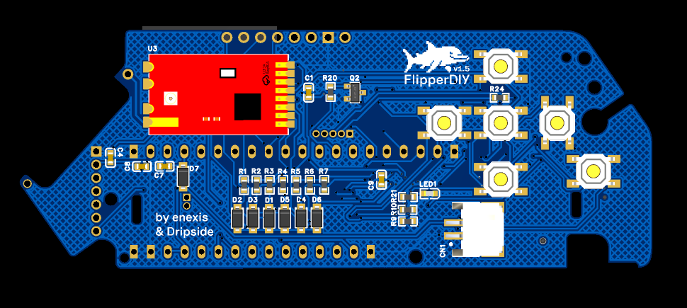

# Flipper DIY
**Designed by enexis & dripside**
[RU Readme](https://github.com/enexis1337/DIY-Flipper-PCB/blob/main/README-RU.md)

This PCB works well with this [firmware](https://github.com/enexis1337/unleashed-cgu6)

This project is an open-source, DIY-friendly replacement PCB for the Flipper Zero. It is designed to be **fully compatible** with the original Flipper Zero housing without any modifications to the plastic shell. Whether you are building from scratch or repairing a device, this board brings the full suite of Flipper capabilities to a custom PCB.

**Firmware Compatibility:**
The PCB trace routing and pinout are fully compatible with the firmware configuration used in the [GthiN89/FuckingCheapFlipperZero](https://github.com/GthiN89/FuckingCheapFlipperZero-DIY-Flipper-zero-The-real-on) project. This ensures that you can use the software and pin definitions from that repository without additional mapping.
## Features & Support

* **Sub-GHz:** Full radio support via external module.
* **NFC:** High-performance NFC read/write capabilities.
* **Infrared (IR):** Dedicated Send and Receive channels.
* **External GPIO:** Standard 0.1" headers for modules and debugging.
* **iButton:** 1-Wire protocol support for Dallas keys.
* **Peripheral Support:** Full support for original buttons and the LCD.
* **Form Factor:** 100% mechanical compatibility with the original case.
* **Buzzer:** On this [firmware](https://github.com/enexis1337/unleashed-cgu6) the PCB also supports buzzer

---

## Bill of Materials (BOM)

| Component | Description | quantity |
| --- | --- | --- |
| [STM32WB55CGU6](https://ali.click/fo7d11q) | **Main MCU:** Dual-core processor with BLE support. | 1x |
| [AS07-M1101s](https://ali.click/5p5571l) | **Sub-GHz Module:** Based on CC1101 for radio communication. | 1x |
| [ST7565R 1.4 inch](https://ali.click/oz7d110) | **Screen:** 128x64 Monochrome LCD. | 1x |
| [ST25R3916](https://www.elechouse.com/product/st25r3916_nfc_reader/) | **NFC Chip:** High-performance NFC/RFID reader. | 1x |
| [SN74HC165D](https://ali.click/ph8d11m) | **Shift Register:** Manages button inputs to save GPIO pins. | 1x |
| **SMD Type-C 16P Connector** | **USB Interface:** For charging and PC data connection. | 1x |
| [SMD MicroSD TF](https://ali.click/52ze11y) | **MicroSD Slot:** Used for storing signal databases (NFC/Sub-GHz/IR) | 1x |
| **IR LED YLED1206R** | **IR Send:** High-power infrared emitter. | 3x |
| **IR Receiver** | **IR Receive:** Demodulator for capturing remote signals. | 1x |
| **3.7V 2000mAh Li-Pol Battery** | **Power:** Standard Li-Po battery. | 1x |
| **SMD Resistors 0603 10kΩ** | **R1, R2, R3, R4, R5, R6, R7, R9, R10** | 9x |
| **SMD Resistors 0603 100Ω** | **R21** | 1x |
| **SMD Resistors 0603 1.0kΩ** | **R18, R20** | 2x |
| **SMD Resistors 0603 5.1kΩ** | **R14, R15** | 2x |
| **SMD Resistors 0603 4.7kΩ** | **R19, R24** | 1x |
| **SMD Resistors 0603 180Ω** | **R17, R22, R23** | 3x |
| **SMD LED 0603** | **Needed to indicate charging** | 1x |
| **SMD IP5306** | **Battery Charger:** Manages Li-Po charging cycles. | 1x |
| **SMD Inductors 0630 2.2UH** | **L1** | 1x |
| **MMBT2222A** | **Q1, Q2** | 2x |
| **1N4148W** | **D1, D2, D3, D4, D5, D6, D7** | 6x |
| **SMD Capacitor 0603 220uF** | **C1, C3, C5, C8** | 4x |
| **SMD Capacitor 0603 20uF** | **C2** | 1x |
| **SMD Capacitor 0603 100nF** | **C4, C7** | 2x |
| **SMD Capacitor 0603 10nF** | **C6, C9** | 2x |
| **[SMD Tactile Buttons 4x4x1,5](https://ali.click/02zw51g)** | **Input:** Navigation and "Back" buttons. | 6x |
| **SMD Passive Buzzer 8540** | **Audio:** Passive transducer for audible alerts and signals. | 1x |

---

## Assembly Instructions

To ensure a successful build, follow this specific soldering order to avoid mechanical interference:

1. **Phase 1 (Low Profile):** Solder the **MicroSD slot**, the **Shift Register (SN74HC165D)**, and all **SMD Resistors**. These are difficult to access once larger components are installed.
2. **Phase 2 (Display):** Install the **LCD screen**. Make sure it is perfectly aligned before soldering the ribbon cable/pins. After soldering, trim off any protruding pins at the back so they don't interfere with subsequent installation of **external GPIOs**.
3. **Phase 3 (Final):** Solder all remaining components, including the MCU, NFC module, and buttons.

---

## GPIO Pinout Guide

Refer to the image below for the correct pin mapping when connecting external modules or sensors.

---

> **Note:** This is a hobbyist project. Ensure you have a fine-tip soldering iron or a hot air station.
